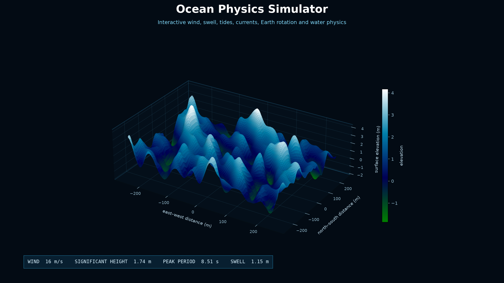
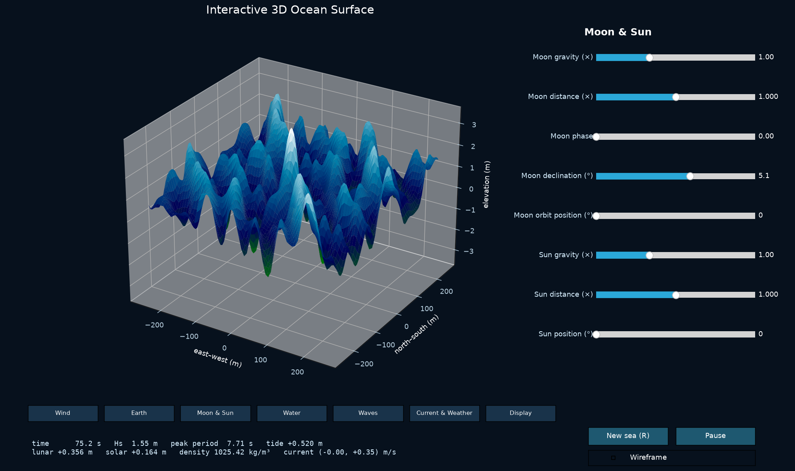

# Ocean Physics Simulator

<p align="center">
  <strong>An interactive 3D laboratory for exploring how wind, gravity, tides, currents, Earth rotation, and water properties shape the ocean surface.</strong>
</p>

<p align="center">
  
  
  
  
</p>



## Overview

Ocean Physics Simulator is a desktop visualization that combines a directional
wind sea, independent swell, astronomical tides, rotating currents, atmospheric
pressure, and finite-depth water physics into a responsive 3D surface.

It is designed for learning, experimentation, and visual intuition. Every major
input can be changed while the simulation is running, making it easy to compare
spring and neap tides, shallow and deep water, calm and storm-force winds, or
different planetary gravity and rotation rates.

> **Important:** This is an educational model, not a weather forecast,
> navigation aid, coastal engineering package, or safety system.

## Highlights

- Real-time, mouse-rotatable 3D ocean surface
- 41 live controls organized into seven focused tabs
- Directional wind sea with fetch and duration growth
- Independent swell height, period, and direction
- Lunar and solar equilibrium tides with phase and distance controls
- Finite-depth gravity and capillary-wave dispersion
- Coriolis-driven current rotation based on latitude
- Current Doppler shift and cross-domain current shear
- Temperature- and salinity-dependent water density
- Atmospheric inverse-barometer response and storm surge
- Shoaling, seabed roughness, coastal reflection, and breaking limits
- Surface and wireframe rendering modes
- Deterministic random seeds for repeatable sea states

## Interface



The controls are grouped by physical role:

| Tab | Adjustable factors |
| --- | --- |
| **Wind** | speed, direction, duration, fetch, gustiness, directional spread, air density |
| **Earth** | gravity, rotation rate, latitude, radius |
| **Moon & Sun** | gravitational strength, distance, phase, declination, orbital position |
| **Water** | depth, temperature, salinity, surface tension, viscosity, damping, seabed and coast |
| **Waves** | swell height, period, direction, wave steepness |
| **Current & Weather** | current speed, direction, shear, pressure, storm surge, rain |
| **Display** | simulation speed and vertical exaggeration |

## Quick start

### macOS

Double-click `start_simulator.command`, or run:

```bash
./start_simulator.command
```

The included launcher uses the project-local virtual environment when one is
present.

### Any platform

```bash
python3 -m venv .venv
source .venv/bin/activate
python -m pip install -r requirements.txt
python ocean_wave_simulator.py
```

On Windows, activate the environment with:

```powershell
.venv\Scripts\activate
python ocean_wave_simulator.py
```

## Interaction

| Action | Control |
| --- | --- |
| Rotate the ocean | Drag with the mouse |
| Zoom | Scroll |
| Pause or resume | `Space` or the Pause button |
| Generate a new sea | `R` or the New sea button |
| Switch surface style | Wireframe checkbox |
| Quit | `Q` or `Escape` |

Useful startup options:

```bash
python ocean_wave_simulator.py --wind-speed 18 --depth 35 --seed 42
python ocean_wave_simulator.py --grid 80 --modes 100
python ocean_wave_simulator.py --help
```

Higher grid and mode counts create more detail but require more processing.

## Model overview

The wind-sea spectrum uses a Pierson–Moskowitz/JONSWAP-like envelope with
fetch- and duration-limited growth. Each spectral component follows the
finite-depth gravity/capillary dispersion relation

```text
ω² = (gk + σk³/ρ) tanh(kh)
```

where `g` is gravitational acceleration, `k` is wavenumber, `σ` is surface
tension, `ρ` is water density, and `h` is local depth.

The rendered elevation combines:

```text
surface = wind sea + swell + lunar tide + solar tide
          + inverse-barometer response + storm surge
```

Currents modify component frequencies through a Doppler term. Earth rotation
produces a latitude-dependent Coriolis frequency, while bathymetry influences
shoaling, damping, and a configurable depth-limited breaking cap.

## Project structure

```text
.
├── ocean_wave_simulator.py   # simulation model and interactive interface
├── start_simulator.command   # macOS launcher
├── requirements.txt          # runtime dependencies
├── docs/images/              # repository screenshots
├── CONTRIBUTING.md
├── LICENSE
└── README.md
```

## Scope and limitations

The simulator intentionally trades forecasting fidelity for interactivity and
clarity. It does not solve the full Navier–Stokes equations, assimilate live
weather data, use a real coastline or bathymetric dataset, or model nonlinear
wave breaking and turbulence in full detail. Astronomical and coastal effects
are compact teaching approximations.

For real-world decisions, use validated oceanographic forecast products and
professional engineering tools.

## Contributing

Bug reports, model improvements, performance work, and visualization ideas are
welcome. See [CONTRIBUTING.md](CONTRIBUTING.md) for the recommended workflow.

## License

Released under the [MIT License](LICENSE).
